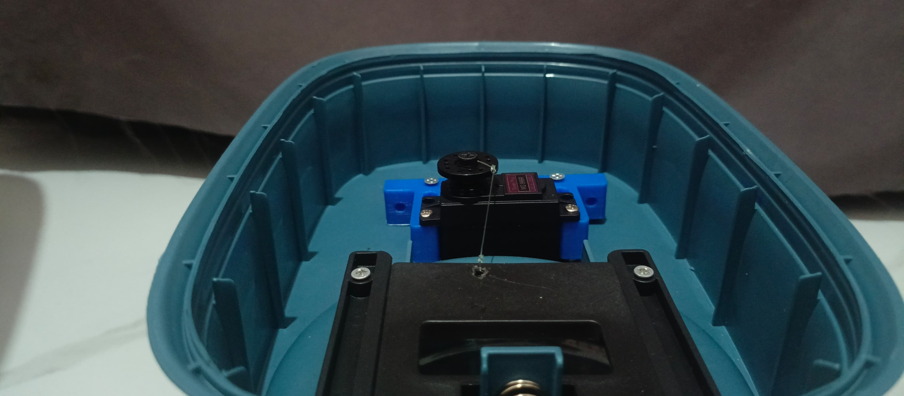
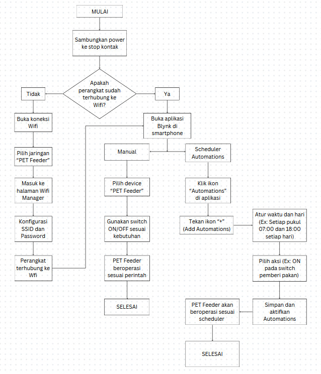
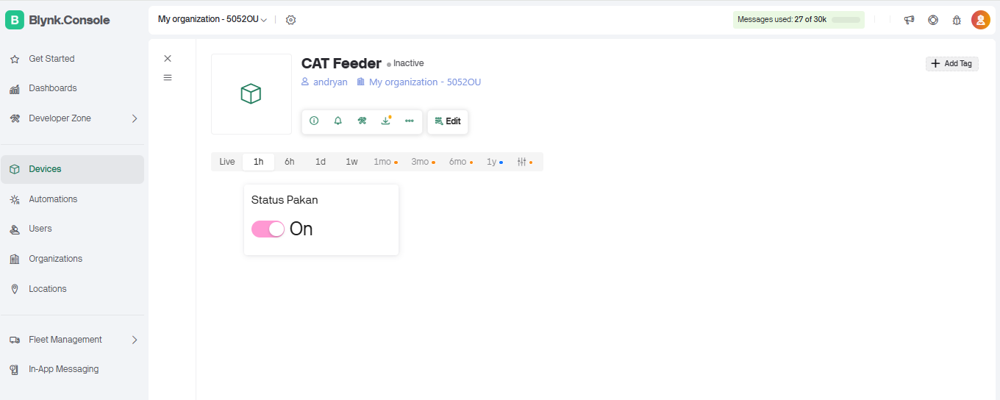
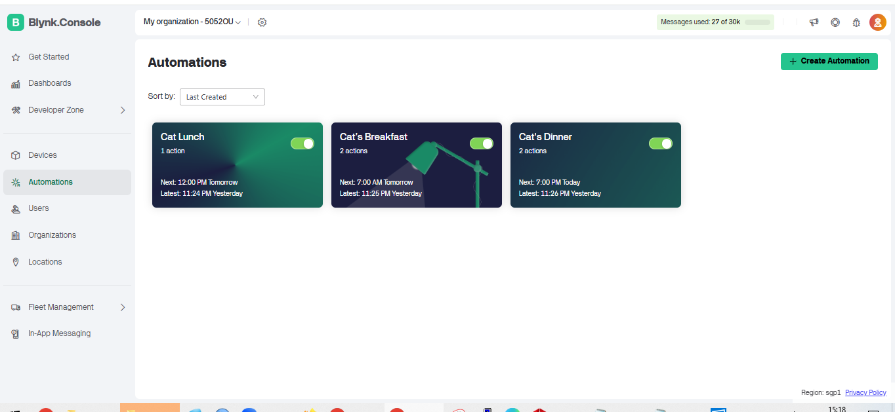

# 🐾 Automatic Cat Feeder

Automatic Cat Feeder adalah solusi modern untuk memastikan kucing kesayangan Anda tetap mendapatkan asupan makanannya secara tepat waktu, bahkan ketika Anda sibuk atau sedang tidak di rumah. Sistem ini mengintegrasikan teknologi ESP32, kontrol servo motor, dan aplikasi Blynk untuk pengoperasian otomatis dan manual melalui internet.

🔽 **[Lihat Catalog](https://heyzine.com/flip-book/6387f498be.html)**

## 📌 Fitur

- ✅ Memberi makan kucing secara otomatis dengan durasi tertentu
- ✅ Kontrol manual melalui aplikasi Blynk
- ✅ Web UI kontrol sudut servo via WiFi
- ✅ Sistem konfigurasi WiFi otomatis (WiFiManager)
- ✅ Material Dispenser Kuat dan Tahan Lama

## 🧩 Komponen yang Digunakan

| Komponen       | Fungsi                                     |
|----------------|---------------------------------------------|
| ESP32          | Otak sistem dan koneksi WiFi                |
| Servo Motor    | Menggerakkan pengeluaran makanan            |
| Dispenser Makanan | Menampung dan mengalirkan makanan kucing |
| Aplikasi Blynk | Remote kontrol via smartphone               |

---

## 🔌 Wiring Diagram

Berikut adalah diagram sambungan antara ESP32 dan Servo Motor:

<details><summary>See Screenshots</summary>

![]
![]

</details>

## ➡️ Flow Chart
<details><summary>See Screenshots</summary>

![]

</details>

## 🛠️ Instalasi

1. Pasang library berikut di Arduino IDE:
   - `Blynk`
   - `WiFiManager`
   - `ESP32Servo`
   - `WiFi` (default ESP32)

2. Upload kode dari file `cat_feeder.ino` ke board ESP32 Anda.
## 🧾 Source Code (`cat_feeder.ino`)

```cpp
#define BLYNK_TEMPLATE_ID "TMPL6bCd7gOAL"
#define BLYNK_TEMPLATE_NAME "PET Feeder"
#define BLYNK_AUTH_TOKEN "yehGV2eg9XzqPgFa-lP2FZAgqMc_jzTT"

#include <WiFi.h>
#include <WiFiClient.h>
#include <BlynkSimpleEsp32.h>
#include <ESP32Servo.h>
#include <WiFiManager.h>  

// Servo setup
Servo myservo;
const int servoPin = 13;
int servoAngle = 90;

// Status variabel
int StatusPakan = 0;
int lastStatusPakan = -1;
unsigned long waktuPakanMulai = 0;
bool timerAktif = false;
const unsigned long durasiPakan = 5000; // 5 Detik

// Web Server
WiFiServer server(80);

void setup() {
  Serial.begin(115200);

  WiFiManager wm;
  wm.resetSettings(); // Paksa AP mode
  bool res = wm.autoConnect("PET_FEEDER");

  if (!res) {
    Serial.println("Gagal konek ke WiFi. Masuk ke AP Mode...");
    delay(3000);
    ESP.restart();
  }

  Serial.println("WiFi Connected.");
  Serial.print("ESP32 IP address: http://");
  Serial.println(WiFi.localIP());

  Blynk.begin(BLYNK_AUTH_TOKEN, WiFi.SSID().c_str(), WiFi.psk().c_str());
  Serial.println("Blynk Connected.");

  server.begin();
  myservo.attach(servoPin);
  myservo.write(servoAngle);
}

// Tambahan: sinkronisasi Automation
BLYNK_CONNECTED() {
  Blynk.syncVirtual(V0);  // Penting agar automation trigger saat koneksi awal
}

// Handler dari Automation / Manual button
BLYNK_WRITE(V0) {
  StatusPakan = param.asInt();
  Serial.print("BLYNK_WRITE V0 triggered: ");
  Serial.println(StatusPakan);
  
  if (StatusPakan == 1) {
    BeriPakan();
    waktuPakanMulai = millis();
    timerAktif = true;
  } else {
    MatikanPakan();
    timerAktif = false;
  }
}

void BeriPakan() {
  myservo.write(180);
}

void MatikanPakan() {
  myservo.write(0);
}

void loop() {
  Blynk.run();

  if (timerAktif && millis() - waktuPakanMulai >= durasiPakan) {
    StatusPakan = 0;
    MatikanPakan();
    Blynk.virtualWrite(V0, 0);
    Serial.println("Otomatis OFF setelah 5 detik");
    timerAktif = false;
  }

  if (StatusPakan != lastStatusPakan) {
    Serial.print("Status Pakan : ");
    Serial.println(StatusPakan);
    lastStatusPakan = StatusPakan;
  }

  // Web control via slider
  WiFiClient client = server.available();
  if (client) {
    String request = client.readStringUntil('\r');
    client.flush();

    if (request.indexOf("/servo?angle=") != -1) {
      int angleIndex = request.indexOf('=') + 1;
      int angle = request.substring(angleIndex).toInt();
      if (angle >= 0 && angle <= 180) {
        servoAngle = angle;
        myservo.write(servoAngle);
      }
    }

    client.println("HTTP/1.1 200 OK");
    client.println("Content-type:text/html");
    client.println();

    client.println("<!DOCTYPE html><html>");
    client.println("<head><meta name='viewport' content='width=device-width, initial-scale=1'>");
    client.println("<style>");
    client.println("body { background-color: #0f172a; color: #f1f5f9; font-family: 'Segoe UI', sans-serif; text-align: center; padding-top: 50px; }");
    client.println(".slider { width: 80%; }");
    client.println("h1 { color: #38bdf8; }");
    client.println(".footer { position: fixed; bottom: 10px; width: 100%; text-align: center; font-weight: bold; color: #60a5fa; font-size: 16px; }");
    client.println("</style></head>");
    
    client.println("<body>");
    client.println("<h1>ESP32 Servo Control</h1>");
    client.print("<p>Angle: <span id='val'>");
    client.print(servoAngle);
    client.println("</span>°</p>");
    client.println("<input type='range' min='0' max='180' value='" + String(servoAngle) + "' class='slider' id='servoRange'>");

    client.println("<script>");
    client.println("let slider = document.getElementById('servoRange');");
    client.println("let val = document.getElementById('val');");
    client.println("slider.oninput = function() {");
    client.println("val.innerHTML = this.value;");
    client.println("fetch('/servo?angle=' + this.value);");
    client.println("}");
    client.println("</script>");

    client.println("<div class='footer'>Global Institute</div>");
    client.println("</body></html>");

    client.stop();
  }
}

```

4. Jalankan dan koneksikan WiFi melalui portal otomatis dari ESP32 (`SSID: PET_FEEDER`).

5. Gunakan Blynk App dan Web UI untuk memberi makan.

---

## 🌐 Web Interface

Setelah ESP32 terhubung ke WiFi, Anda dapat mengakses kontrol manual servo via browser:
```
http://<alamat_IP_ESP32>
```

---

## 📱 Kontrol Blynk

<details><summary>See Screenshots</summary>

![]
![]

</details>

- Virtual Pin: `V0`
- Tombol ON/OFF untuk mengaktifkan/mematikan servo 

---

## 💬 Credit

Proyek ini dibuat Untuk memenuhi Tugas UAS di Kampus Global Institute

---

## 👥 Nama Kelompok

- 🧑‍💻 Andyan Rizki F  
- 🧑‍💻 Muhammad Rama Nurhuda  
- 👩‍💻 Lestari Tegari Ningsih  
- 🧑‍💻 Muhammad Anwar Lain  
- 🧑‍💻 Rakha Ananta Hugo Riyadi

---
