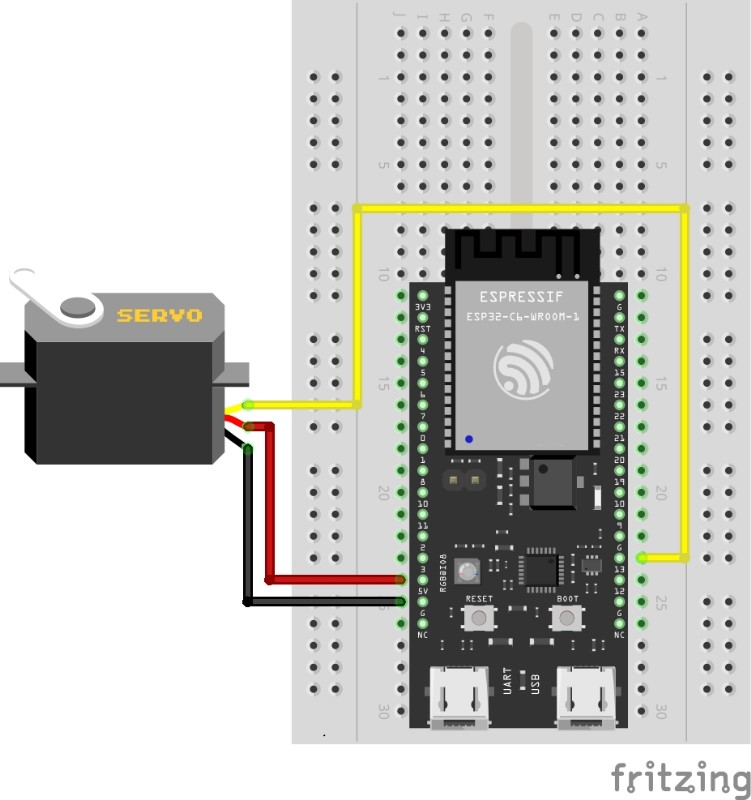

# 🐾 Automatic Cat Feeder

Automatic Cat Feeder adalah solusi modern untuk memastikan kucing kesayangan Anda tetap mendapatkan asupan makanannya secara tepat waktu, bahkan ketika Anda sibuk atau sedang tidak di rumah. Sistem ini mengintegrasikan teknologi ESP32, kontrol servo motor, dan aplikasi Blynk untuk pengoperasian otomatis dan manual melalui internet.

## 📌 Fitur

- ✅ Memberi makan kucing secara otomatis dengan durasi tertentu
- ✅ Kontrol manual melalui aplikasi Blynk
- ✅ Web UI kontrol sudut servo via WiFi
- ✅ Sistem konfigurasi WiFi otomatis (WiFiManager)
- ✅ Desain antarmuka web minimalis dan responsif

## 🧩 Komponen yang Digunakan

| Komponen       | Fungsi                                     |
|----------------|---------------------------------------------|
| ESP32          | Otak sistem dan koneksi WiFi                |
| Servo Motor    | Menggerakkan pengeluaran makanan            |
| Dispenser Makanan | Menampung dan mengalirkan makanan kucing |
| Aplikasi Blynk | Remote kontrol via smartphone               |

## 🔌 Wiring Diagram

Berikut adalah diagram sambungan antara ESP32 dan Servo Motor:

<div style="display: flex; justify-content: center; gap: 20px;">

  

  

</div>

## 🛠️ Instalasi

1. Pasang library berikut di Arduino IDE:
   - `Blynk`
   - `WiFiManager`
   - `ESP32Servo`
   - `WiFi` (default ESP32)

2. Upload kode dari file `cat_feeder.ino` ke board ESP32 Anda.
## 🧾 Source Code (`cat_feeder.ino`)

```cpp
#define BLYNK_TEMPLATE_ID "TMPL6bCd7gOAL"
#define BLYNK_TEMPLATE_NAME "PET Feeder"
#define BLYNK_AUTH_TOKEN "yehGV2eg9XzqPgFa-lP2FZAgqMc_jzTT"

#include <WiFi.h>
#include <WiFiClient.h>
#include <BlynkSimpleEsp32.h>
#include <ESP32Servo.h>
#include <WiFiManager.h>

Servo myservo;
const int servoPin = 13;
int servoAngle = 90;

int StatusPakan = 0;
int lastStatusPakan = -1;
unsigned long waktuPakanMulai = 0;
bool timerAktif = false;
const unsigned long durasiPakan = 5000;

WiFiServer server(80);

void setup() {
  Serial.begin(115200);
  WiFiManager wm;
  wm.resetSettings();
  bool res = wm.autoConnect("PET_FEEDER");

  if (!res) {
    Serial.println("Gagal konek ke WiFi.");
    delay(3000);
    ESP.restart();
  }

  Serial.print("IP ESP32: http://");
  Serial.println(WiFi.localIP());

  Blynk.begin(BLYNK_AUTH_TOKEN, WiFi.SSID().c_str(), WiFi.psk().c_str());
  server.begin();

  myservo.attach(servoPin);
  myservo.write(servoAngle);
}

void BeriPakan() {
  myservo.write(180);
}

void MatikanPakan() {
  myservo.write(0);
}

BLYNK_WRITE(V0) {
  StatusPakan = param.asInt();
  if (StatusPakan == 1) {
    BeriPakan();
    waktuPakanMulai = millis();
    timerAktif = true;
  } else {
    MatikanPakan();
    timerAktif = false;
  }
}

void loop() {
  Blynk.run();

  if (timerAktif && millis() - waktuPakanMulai >= durasiPakan) {
    StatusPakan = 0;
    MatikanPakan();
    Blynk.virtualWrite(V0, 0);
    Serial.println("Pakan otomatis dimatikan setelah 5 detik.");
    timerAktif = false;
  }

  if (StatusPakan != lastStatusPakan) {
    Serial.print("Status Pakan: ");
    Serial.println(StatusPakan);
    lastStatusPakan = StatusPakan;
  }

  WiFiClient client = server.available();
  if (client) {
    String request = client.readStringUntil('\r');
    client.flush();

    if (request.indexOf("/servo?angle=") != -1) {
      int angleIndex = request.indexOf('=') + 1;
      int angle = request.substring(angleIndex).toInt();
      if (angle >= 0 && angle <= 180) {
        servoAngle = angle;
        myservo.write(servoAngle);
      }
    }

    client.println("HTTP/1.1 200 OK");
    client.println("Content-type:text/html");
    client.println();

    client.println("<!DOCTYPE html><html><head><meta name='viewport' content='width=device-width, initial-scale=1'>");
    client.println("<style>body { background:#0f172a; color:#f1f5f9; font-family:Segoe UI; text-align:center; padding-top:50px; } .slider { width:80%; } h1 { color:#38bdf8; } .footer { position:fixed; bottom:10px; width:100%; font-weight:bold; color:#60a5fa; }</style></head>");
    client.println("<body><h1>ESP32 Servo Control</h1>");
    client.print("<p>Angle: <span id='val'>"); client.print(servoAngle); client.println("</span>°</p>");
    client.print("<input type='range' min='0' max='180' value='"); client.print(servoAngle); client.println("' class='slider' id='servoRange'>");
    client.println("<script>let slider=document.getElementById('servoRange');let val=document.getElementById('val');slider.oninput=function(){val.innerHTML=this.value;fetch('/servo?angle='+this.value);}</script>");
    client.println("<div class='footer'>Global Institute</div></body></html>");

    client.stop();
  }
}

```

4. Jalankan dan koneksikan WiFi melalui portal otomatis dari ESP32 (`SSID: PET_FEEDER`).

5. Gunakan Blynk App dan Web UI untuk memberi makan.

## 🌐 Web Interface

Setelah ESP32 terhubung ke WiFi, Anda dapat mengakses kontrol manual servo via browser:
```
http://<alamat_IP_ESP32>
```

## 📱 Kontrol Blynk

- Virtual Pin: `V0`
- Tombol ON/OFF untuk mengaktifkan/mematikan servo selama 5 detik

## 💬 Credit

Proyek ini dibuat oleh Muhammad Anwar Lain dan tim.  
Untuk memenuhi Tugas UAS di Kampus Global Institute


---
